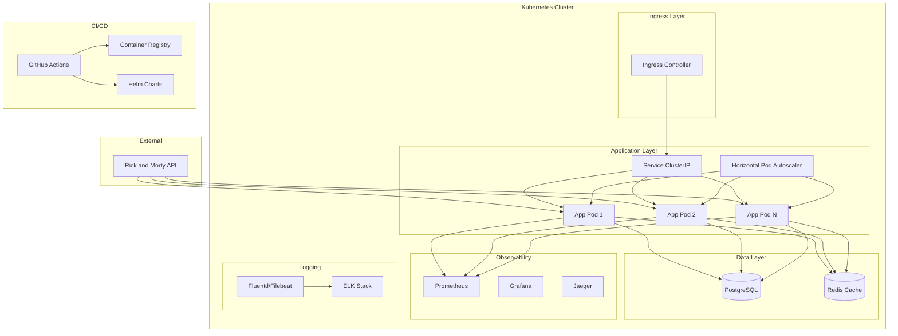
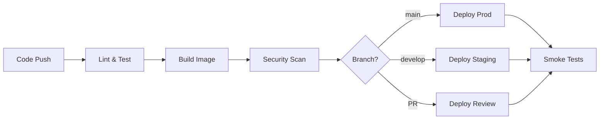

# Rick and Morty SRE Application

A production-grade, highly available, scalable RESTful application that integrates with the Rick and Morty API, demonstrating senior-level SRE and DevOps practices.


## 🎯 Overview

This application filters and serves character data from the Rick and Morty universe, focusing on:
- **Species**: Human
- **Status**: Alive  
- **Origin**: Earth (any variant, e.g., Earth (C-137), Earth (Replacement Dimension))

Built with production-ready SRE principles including high availability, observability, security, and operational excellence.

## 🏗️ Architecture



## ✨ Features

### 🚀 Production-Grade Architecture
- **High Availability**: Multi-pod deployment with HPA and anti-affinity rules
- **Scalability**: Kubernetes-native auto-scaling based on CPU/memory metrics
- **Resilience**: Circuit breakers, retry logic, and graceful degradation
- **Performance**: Redis caching with configurable TTL and intelligent cache invalidation

### 🔍 Observability & Monitoring
- **Metrics**: Comprehensive Prometheus metrics for application and business KPIs
- **Tracing**: Distributed tracing with OpenTelemetry and Jaeger integration
- **Logging**: Structured JSON logging with Fluentd sidecar for aggregation
- **Dashboards**: Pre-built Grafana dashboard with key SLIs and SLOs
- **Alerting**: Production-ready alerts with runbooks and escalation policies

### 🛡️ Security & Reliability
- **Rate Limiting**: Configurable rate limits per endpoint with sliding window
- **Input Validation**: Comprehensive request validation and sanitization
- **Secrets Management**: Kubernetes secrets with external secret manager support
- **Security Scanning**: Automated vulnerability scanning in CI/CD pipeline
- **Non-root Containers**: Security-hardened container images

### 🔄 DevOps & Automation
- **CI/CD Pipeline**: Comprehensive GitHub Actions workflow with multi-environment support
- **Infrastructure as Code**: Helm charts with environment-specific configurations
- **Automated Testing**: Unit, integration, and load tests with coverage reporting
- **Container Optimization**: Multi-stage builds with security best practices

## 🚀 Quick Start

### Prerequisites

- **Docker** (20.x+)
- **Kubernetes** cluster (1.20+) - minikube, kind, or cloud provider
- **Helm** (3.x)
- **kubectl** configured for your cluster

### 🐳 Local Development with Docker Compose

```bash
# Clone the repository
git clone <repository-url>
cd rick-morty-sre-app

# Start all services
docker-compose up -d

# Check application health
curl http://localhost:8000/healthcheck

# View logs
docker-compose logs -f app
```

### 🔧 Local Python Development

```bash
# Set up Python environment
python -m venv venv
source venv/bin/activate  # Windows: venv\Scripts\activate

# Install dependencies
pip install -r requirements.txt

# Copy environment configuration
cp env.example .env

# Run the application
uvicorn app.main:app --reload --host 0.0.0.0 --port 8000
```

### ☸️ Kubernetes Deployment

```bash
# Quick deployment with default values
helm install rick-morty-app ./helm/rick-morty-app \
  --namespace rick-morty-app --create-namespace

# Or use the deployment script
export ENVIRONMENT=development
./scripts/deploy.sh

# Access the application
kubectl port-forward service/rick-morty-app 8080:80 -n rick-morty-app
curl http://localhost:8080/healthcheck
```

### 🎯 Production Deployment

```bash
# Deploy to production with external database
helm install rick-morty-prod ./helm/rick-morty-app \
  --namespace rick-morty-prod --create-namespace \
  --set postgresql.enabled=false \
  --set redis.enabled=false \
  --set secrets.databaseUrl="$DATABASE_URL" \
  --set secrets.redisUrl="$REDIS_URL" \
  --set ingress.hosts[0].host="rick-morty-api.yourdomain.com"
```

## 📚 API Documentation

### Core Endpoints

| Endpoint | Method | Description | Rate Limit |
|----------|--------|-------------|------------|
| `/characters` | GET | Retrieve filtered characters with pagination and sorting | 100/min |
| `/characters/{id}` | GET | Get specific character by ID | 100/min |
| `/stats` | GET | Get character statistics and metrics | 5/min |
| `/healthcheck` | GET | Deep health check with dependency status | 10/min |
| `/metrics` | GET | Prometheus metrics for monitoring | None |
| `/sync` | POST | Manually trigger data synchronization | 1/min |

### 🔍 Character Filtering

The API automatically filters characters based on:
- **Species**: `Human` only
- **Status**: `Alive` only  
- **Origin**: Any Earth variant (e.g., `Earth (C-137)`, `Earth (Replacement Dimension)`)

### 📖 Example Usage

```bash
# Get paginated characters
curl "https://rick-morty-api.example.com/characters?page=1&per_page=10"

# Get characters sorted by name
curl "https://rick-morty-api.example.com/characters?sort=name&order=asc"

# Get specific character
curl "https://rick-morty-api.example.com/characters/1"

# Check application health
curl "https://rick-morty-api.example.com/healthcheck"

# Get application statistics
curl "https://rick-morty-api.example.com/stats"

# Trigger manual sync
curl -X POST "https://rick-morty-api.example.com/sync"
```

### 📄 Response Format

```json
{
  "characters": [
    {
      "id": 1,
      "name": "Rick Sanchez",
      "status": "Alive",
      "species": "Human",
      "origin_name": "Earth (C-137)",
      "image_url": "https://rickandmortyapi.com/api/character/avatar/1.jpeg",
      "created_at": "2023-01-01T12:00:00.000Z"
    }
  ],
  "pagination": {
    "page": 1,
    "per_page": 10,
    "total": 150,
    "total_pages": 15,
    "has_next": true,
    "has_prev": false
  }
}
```

**📋 For complete API documentation, see [docs/API.md](docs/API.md)**

## 🛠️ Development

### Running Tests

```bash
# Install test dependencies
pip install -r requirements.txt

# Run all tests with coverage
pytest

# Run specific test suites
pytest tests/unit/          # Unit tests only
pytest tests/integration/   # Integration tests only
pytest tests/ -m "not slow" # Skip slow tests

# Generate coverage report
pytest --cov=app --cov-report=html
open htmlcov/index.html
```

### Code Quality

```bash
# Format code
black app/ tests/
isort app/ tests/

# Lint code
flake8 app/ tests/
mypy app/

# Security scanning
bandit -r app/

# Run all quality checks
./scripts/quality-check.sh
```

### Load Testing

```bash
# Install Locust
pip install locust

# Run load tests
locust -f tests/load/locustfile.py --host=http://localhost:8000
```

## 🚀 Deployment

### CI/CD Pipeline

The application uses GitHub Actions for comprehensive CI/CD:



**🔄 For detailed deployment instructions, see [docs/DEPLOYMENT.md](docs/DEPLOYMENT.md)**

## 📊 Monitoring & Observability

### Key Metrics Dashboard

- **Golden Signals**: Latency, Traffic, Errors, Saturation
- **Business Metrics**: Character counts, sync operations, API response times  
- **Infrastructure**: CPU, Memory, Disk, Network usage
- **Dependencies**: Database connections, cache performance, external API health

### 🚨 Production Alerts

| Alert | Threshold | Severity | Action |
|-------|-----------|----------|--------|
| High Error Rate | >5% for 5min | Critical | Page on-call |
| High Latency | p95 >500ms for 5min | Warning | Investigate |
| Pod Crash Loop | >3 restarts in 10min | Critical | Page on-call |
| Database Down | Connection failure | Critical | Emergency response |
| Low Cache Hit Rate | <70% for 10min | Warning | Check Redis |

### 📈 SLIs & SLOs

- **Availability**: 99.9% uptime (8.76 hours downtime/year)
- **Latency**: p95 < 500ms, p99 < 1s
- **Error Rate**: < 1% of requests result in 5xx errors
- **Throughput**: Support 1000 RPS sustained load

## 🏗️ Project Structure

```
rick-morty-sre-app/
├── app/                    # Application source code
│   ├── __init__.py
│   ├── main.py            # FastAPI application entry point
│   ├── config.py          # Configuration management
│   ├── models.py          # Database and API models
│   ├── database.py        # Database connection and session management
│   ├── cache.py           # Redis cache implementation
│   ├── services.py        # Business logic services
│   ├── rick_morty_client.py # External API client with resilience
│   ├── metrics.py         # Prometheus metrics
│   └── tracing.py         # OpenTelemetry distributed tracing
├── tests/                 # Test suite
│   ├── unit/             # Unit tests
│   ├── integration/      # Integration tests
│   ├── load/             # Load testing with Locust
│   └── conftest.py       # Test configuration and fixtures
├── k8s/                  # Raw Kubernetes manifests
├── helm/                 # Helm chart
│   └── rick-morty-app/
│       ├── Chart.yaml
│       ├── values.yaml
│       └── templates/
├── monitoring/           # Observability configurations
│   ├── grafana-dashboard.json
│   └── alerts.yml
├── scripts/              # Utility scripts
│   └── deploy.sh         # Deployment automation
├── docs/                 # Documentation
│   ├── API.md           # API documentation
│   └── DEPLOYMENT.md    # Deployment guide
├── .github/              # CI/CD workflows
│   └── workflows/
│       └── ci-cd.yml
├── Dockerfile            # Multi-stage container build
├── docker-compose.yml    # Local development environment
├── requirements.txt      # Python dependencies
└── README.md            # This file
```

## 🤝 Contributing

We welcome contributions! Please follow these steps:

1. **Fork** the repository
2. **Create** a feature branch: `git checkout -b feature/amazing-feature`
3. **Commit** your changes: `git commit -m 'Add amazing feature'`
4. **Push** to the branch: `git push origin feature/amazing-feature`
5. **Open** a Pull Request

### Development Guidelines

- Follow [PEP 8](https://pep8.org/) for Python code style
- Write tests for new features and bug fixes
- Update documentation for API changes
- Use conventional commit messages
- Ensure all CI checks pass

## 📄 License

This project is licensed under the MIT License - see the [LICENSE](LICENSE) file for details.

## 🙏 Acknowledgments

- [Rick and Morty API](https://rickandmortyapi.com/) for providing the excellent REST API
- The open-source community for the amazing tools and libraries used in this project

## 📞 Support

- 📧 **Email**: sre-team@example.com
- 💬 **Slack**: #rick-morty-sre-app
- 🐛 **Issues**: [GitHub Issues](https://github.com/your-org/rick-morty-sre-app/issues)
- 📖 **Documentation**: [Project Wiki](https://github.com/your-org/rick-morty-sre-app/wiki)

---

**Built with ❤️ by the SRE Team**
